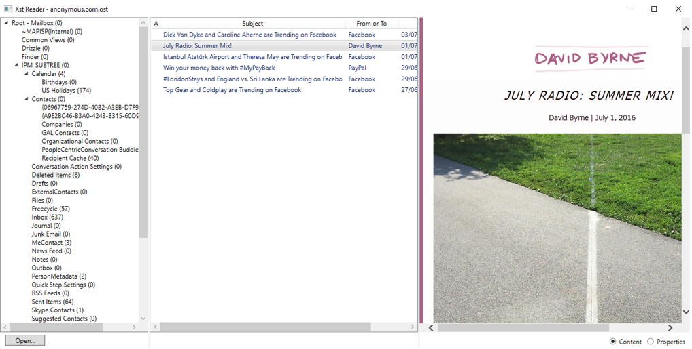

# Xst Reader

Xst Reader is an open source reader for Microsoft Outlook `.ost` and `.pst` files, written in C# and modernized to `.NET 10`.

This repository is a maintained fork of the original [Dijji/XstReader](https://github.com/Dijji/XstReader). It keeps the original parser and application model while updating the codebase, packaging, and build workflow for current .NET.



## Projects

- `src/XstReader`
  Windows desktop viewer for browsing messages, attachments, recipients, and properties
- `src/XstExport`
  Command-line exporter for messages, attachments, and CSV property dumps
- `src/XstReader.Base`
  Shared PST/OST parsing library used by both applications

## Runtime Support

- `XstReader` targets `net10.0-windows` and is Windows-only
- `XstExport` targets `net10.0`
- `XstReader.Base` multi-targets `net10.0` and `net10.0-windows`
- `XstExport` can be published for `win-x64`, `win-arm64`, `linux-x64`, `linux-arm64`, `osx-x64`, and `osx-arm64`
- non-Windows `XstExport` builds are publish-verified but not yet runtime-tested on native Linux/macOS systems

## Features

`XstReader` provides:

- three-pane Outlook-style browsing
- viewing of plain text, HTML, and RTF message bodies
- recipient and attachment inspection
- message property inspection
- export of messages and attachments from the UI

`XstExport` provides:

- export of email bodies in native format
- export of attachments only
- export of message properties to CSV
- export from the whole mailbox or from a selected subtree
- optional preservation of Outlook subfolder structure

## Quick Start

```powershell
dotnet build XstReader.sln
dotnet test tests\XstReader.Base.Tests\XstReader.Base.Tests.csproj
dotnet run --project src\XstReader\XstReader.csproj
dotnet run --project src\XstExport\XstExport.csproj -- --help
```

## Downloads

Current release assets for `2.1.2`:

- [XstReader-win-x64.zip](https://github.com/NeedsCoffee/XstReaderNext/releases/download/v2.1.2/XstReader-win-x64.zip)
- [XstReader-win-arm64.zip](https://github.com/NeedsCoffee/XstReaderNext/releases/download/v2.1.2/XstReader-win-arm64.zip)
- [XstExport-win-x64.zip](https://github.com/NeedsCoffee/XstReaderNext/releases/download/v2.1.2/XstExport-win-x64.zip)
- [XstExport-win-arm64.zip](https://github.com/NeedsCoffee/XstReaderNext/releases/download/v2.1.2/XstExport-win-arm64.zip)
- [XstExport-linux-x64.tar.gz](https://github.com/NeedsCoffee/XstReaderNext/releases/download/v2.1.2/XstExport-linux-x64.tar.gz)
- [XstExport-linux-arm64.tar.gz](https://github.com/NeedsCoffee/XstReaderNext/releases/download/v2.1.2/XstExport-linux-arm64.tar.gz)
- [XstExport-osx-x64.tar.gz](https://github.com/NeedsCoffee/XstReaderNext/releases/download/v2.1.2/XstExport-osx-x64.tar.gz)
- [XstExport-osx-arm64.tar.gz](https://github.com/NeedsCoffee/XstReaderNext/releases/download/v2.1.2/XstExport-osx-arm64.tar.gz)

## Documentation

- [Docs index](docs/index.md)
- [Build guide](docs/build.md)
- [Architecture](docs/architecture.md)
- [Testing](docs/testing.md)
- [Release notes](docs/releases.md)
- [MS-PST specification](https://learn.microsoft.com/en-us/openspecs/office_file_formats/ms-pst/141923d5-15ab-4ef1-a524-6dce75aae546)

## Background

The original motivation for the project was simple: open `.ost` files without Outlook. That remains one of the main reasons the tool is useful.

The parser is based on Microsoft’s published Outlook file format documentation in [MS-PST](https://learn.microsoft.com/en-us/openspecs/office_file_formats/ms-pst/141923d5-15ab-4ef1-a524-6dce75aae546).

## Project Metadata

- [Contributing guide](CONTRIBUTING.md)
- [Security policy](SECURITY.md)
- [License](LICENSE.md)
