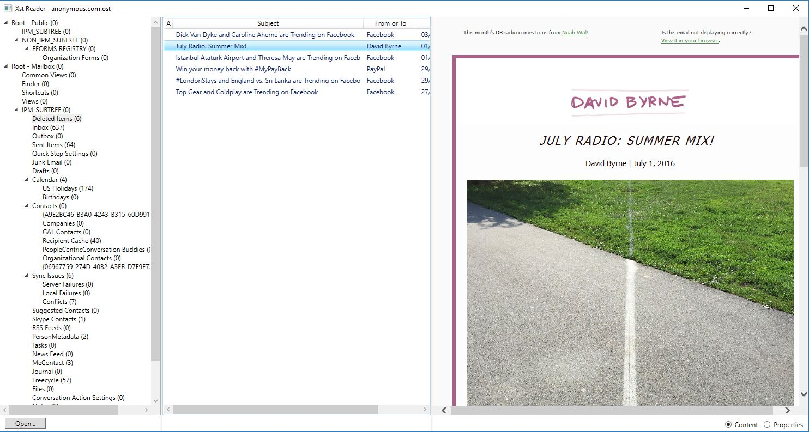

# Xst Reader Docs

Xst Reader is an open source Outlook `.ost` and `.pst` reader with a Windows desktop UI and a separate CLI exporter.

## Documentation Map

- [Build guide](build.md)
- [Architecture](architecture.md)
- [Testing](testing.md)
- [Releases](releases.md)
- [MS-PST specification](https://learn.microsoft.com/en-us/openspecs/office_file_formats/ms-pst/141923d5-15ab-4ef1-a524-6dce75aae546)

## Project Summary

- `XstReader`
  Windows desktop viewer for browsing mail, attachments, recipients, and properties
- `XstExport`
  Command-line exporter for messages, attachments, and CSV property dumps
- `XstReader.Base`
  Shared PST/OST parsing library used by both apps

## Background

This repository is a maintained fork of the original `Dijji/XstReader` codebase. The current line modernizes the project to `.NET 10` while preserving the original reader/exporter model.

The project exists primarily to make `.ost` and `.pst` data accessible without requiring Outlook.
